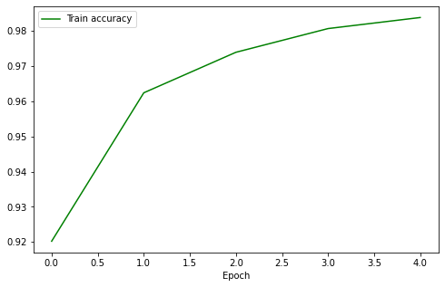
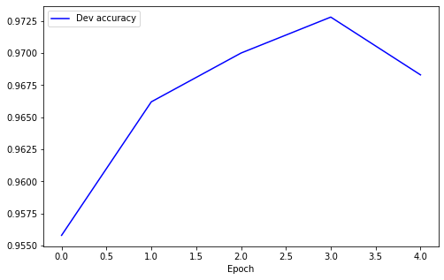

# Neural Net
This repository aims to implement a simple Deep Learning library.
You can create your own deep neural network, train it and test it.
In this notebook, I used the MNIST dataset to train and test several
neural networks

This project comes from a lab exercise of the Deep Learning course
taught in the first year of the Artificial Intelligence master of 
the university Paris-Saclay.

## Accuracies

